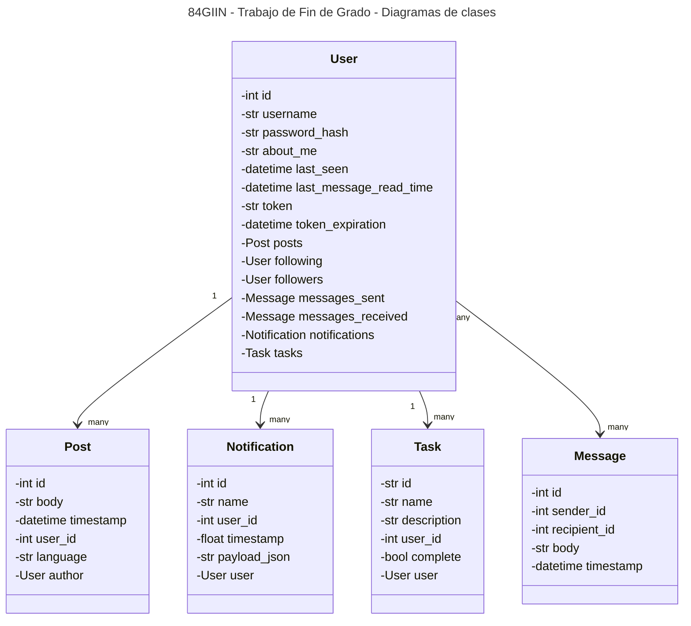
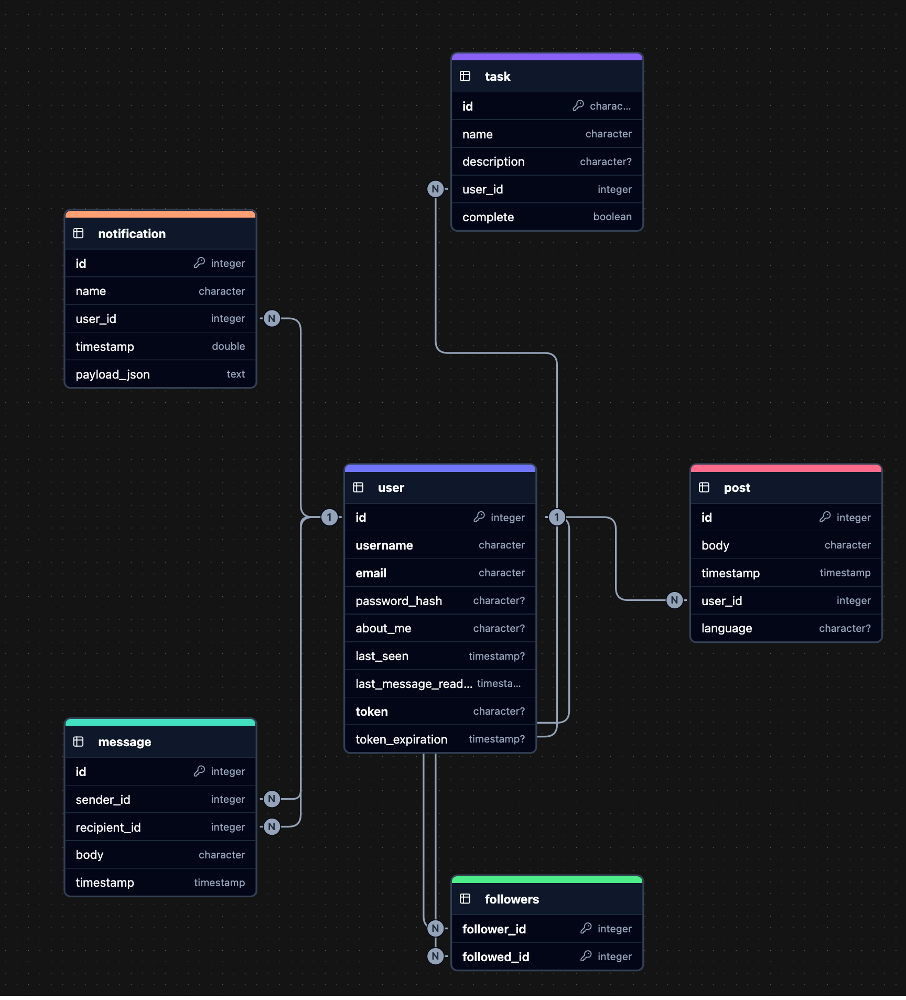

# Diagrama de clases

El siguiente diagrama de clases muestra las principales clases (siendo la principal claramente `User`).
Por una cuestión de simplicidad no se muestran los métodos de clase.

---

# Diagrama Entidad-Relacion (ERD)

El siguiente diagrama muestra el esquema de clases en la base de datos del proyecto de microblog.

Las 6 grandes entidades como se pueden ver son:
- **User:** Un usuario simple.
- **Message:** Un mensaje a ser enviado entre usuarios.
- **Notification:** Una notificación que le aparece a cada usuario.
- **Task:** Una tarea pero no para el usuario si no más bien un background task.
- **Post:** Un posteo, esto es, una entrada en el blog.
- **Follower:** Tabla intermedia para relacion `M:N` entre usuarios como followers (similar al concepto de twitter o instagram).

