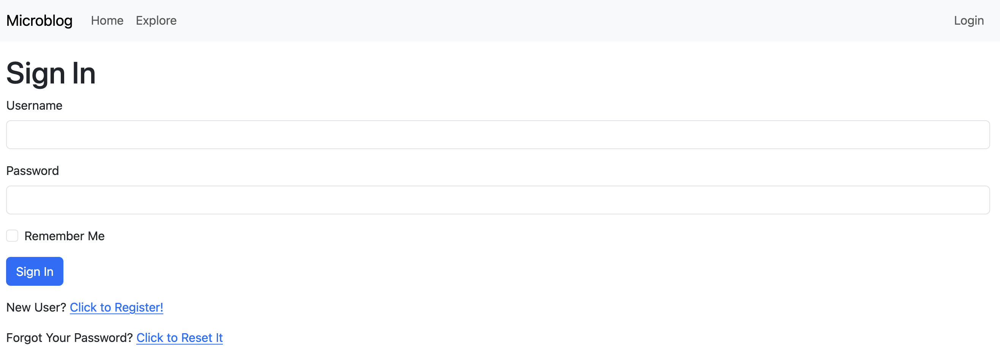

## MicroBlog App

## Requirements

- Python >= 3.9

## Installing

### Local Environment

Installing and running is as easy as:

```shell
# Install required libraries
% pip install -r requirements.txt
# Create DB
% flask db upgrade
# Run the app
% exec gunicorn -b :5000 --access-logfile - --error-logfile - microblog:app
```

### Using docker

- To build the docker image and running it locally:

```shell
% docker build -t microblog:latest .
% docker run -ti --rm -p 5000:5000 microblog:latest
```

- Alternatively you can also run it with docker compose. Building the container and running it on the same command:

```shell
% docker compose up -d --build --remove-orphans
```

### Testing the app

Visit `http://localhost:5000`




## Environment Variables

The following environment variables can be set or be taken as default for development, testing or remote deployment.

| Environment Variable     | Mandatory | Default Value                    | Notes                                                              |
|--------------------------|-----------|----------------------------------|--------------------------------------------------------------------|
| SECRET_KEY               | No        | `"you-will-never-guess"`         | Used for session security                                          |
| SERVER_NAME              | No        | `None`                           | Flask server name                                                  |
| DATABASE_URL             | No        | `"sqlite:///<basedir>/app.db"`   | External DB setup. Only PostgreSQL is available                    |
| LOG_TO_STDOUT            | No        | `None`                           | Enables logging to stdout (useful for debugging)                   |
| MAIL_SERVER              | No        | `None`                           | SMTP server address                                                |
| MAIL_PORT                | No        | `25`                             | SMTP server port                                                   |
| MAIL_USE_TLS             | No        | `False`                          | Use TLS for email                                                  |
| MAIL_USERNAME            | No        | `None`                           | SMTP username                                                      |
| MAIL_PASSWORD            | No        | `None`                           | SMTP password                                                      |
| MS_TRANSLATOR_KEY        | No        | `None`                           | Microsoft Translator API key (required for es/en live translation) |
| ELASTICSEARCH_URL        | No        | `None`                           | Elasticsearch server URL. Required for search indexing             |
| REDIS_URL                | No        | `"redis://"`                     | Redis connection URL. Required for Async Tasks                     |
| MAX_POSTS                | No        | `25`                             | Number of posts per page                                           |

## Disclaimer

Part of the idea of this app was taken from [Miguel Grinberg's Flask Mega-Tutorial Course](https://blog.miguelgrinberg.com/post/the-flask-mega-tutorial-part-i-hello-world). All credits to him