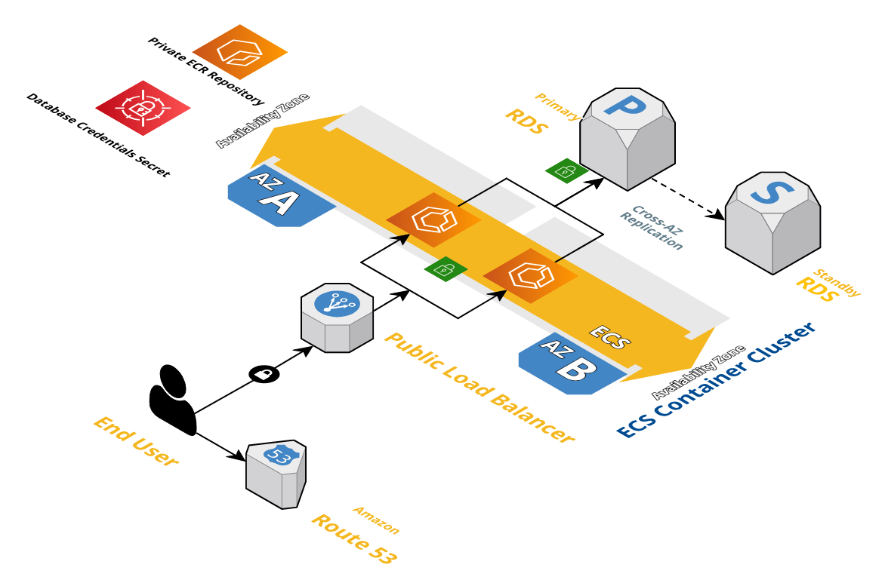

# Microblog Terraform Repo



## Requisitos

- Terraform >= v1.5.7
- Docker o equivalente (por ejemplo: finch, podman)

## Notas

- Este repositorio requiere que exista el bucket `microblog-tfstate` para guardar el archivo tfstate de terraform. Cámbialo según tus necesidades [aquí](./tfstate.tf#L5), bien puedes comentar ese archivo o removerlo y el tfstate será guardado localmente

## Qué esperar de este repositorio

El repositorio contiene el código para:
- Construir la imagen del contenedor de [microblog](../microblog/) localmente
- Subirla a un repositorio privado ECR
- Crear un ALB (solo puerto HTTP/80) abierto al mundo
- Una instancia RDS (PostgreSQL)
- Infraestructura ECS (task definition, service, IAM role)
- Crear una zona privada en Route53 con un registro apuntando a la instancia de RDS
- Un k/v de secretsmanager que contiene la URL de la base de datos para que la app microblog se conecte
- Toda la infraestructura de red con todos los grupos de seguridad gestionados correctamente

## Cómo ejecutar esto

1. Asegúrate de haber exportado las variables de entorno adecuadas o haber configurado tus credenciales de AWS
1. Luego simplemente ejecuta:

```
% terraform init
% terraform apply -var-file=prod.tfvars
```

Y para eliminar todo, simplemente:

```
% terraform destroy -var-file=prod.tfvars
```

Para `forzar un rebuild del contenedor`, lo cual recreará una nueva imagen de docker y por tanto una nueva task definition, puedes usar:

```
% terraform apply -var-file=prod.tfvars -var=force_image_rebuild=true
```

---

# Terraform

## Providers

| Name | Version |
|------|---------|
| <a name="provider_aws"></a> [aws](#provider\_aws) | n/a |
| <a name="provider_null"></a> [null](#provider\_null) | n/a |
| <a name="provider_random"></a> [random](#provider\_random) | n/a |

## Modules

| Name | Source | Version |
|------|--------|---------|
| <a name="module_ecr"></a> [ecr](#module\_ecr) | terraform-aws-modules/ecr/aws | ~> 2.4.0 |
| <a name="module_microblog_db"></a> [microblog\_db](#module\_microblog\_db) | terraform-aws-modules/rds/aws | ~> 6.12.0 |
| <a name="module_vpc"></a> [vpc](#module\_vpc) | terraform-aws-modules/vpc/aws | ~> 5.19.0 |

## Resources

| Name | Type |
|------|------|
| [aws_alb.main](https://registry.terraform.io/providers/hashicorp/aws/latest/docs/resources/alb) | resource |
| [aws_alb_listener.http_listener_id](https://registry.terraform.io/providers/hashicorp/aws/latest/docs/resources/alb_listener) | resource |
| [aws_alb_target_group.microblog](https://registry.terraform.io/providers/hashicorp/aws/latest/docs/resources/alb_target_group) | resource |
| [aws_cloudwatch_log_group.microblog](https://registry.terraform.io/providers/hashicorp/aws/latest/docs/resources/cloudwatch_log_group) | resource |
| [aws_ecs_cluster.microblog](https://registry.terraform.io/providers/hashicorp/aws/latest/docs/resources/ecs_cluster) | resource |
| [aws_ecs_service.microblog](https://registry.terraform.io/providers/hashicorp/aws/latest/docs/resources/ecs_service) | resource |
| [aws_ecs_task_definition.microblog](https://registry.terraform.io/providers/hashicorp/aws/latest/docs/resources/ecs_task_definition) | resource |
| [aws_iam_policy.secrets_access_policy](https://registry.terraform.io/providers/hashicorp/aws/latest/docs/resources/iam_policy) | resource |
| [aws_iam_role.ecs_task_execution_role](https://registry.terraform.io/providers/hashicorp/aws/latest/docs/resources/iam_role) | resource |
| [aws_iam_role_policy_attachment.ecs_task_execution_role_policy_attachment](https://registry.terraform.io/providers/hashicorp/aws/latest/docs/resources/iam_role_policy_attachment) | resource |
| [aws_iam_role_policy_attachment.ecs_task_execution_secrets_policy_attachment](https://registry.terraform.io/providers/hashicorp/aws/latest/docs/resources/iam_role_policy_attachment) | resource |
| [aws_route53_record.microblog_db](https://registry.terraform.io/providers/hashicorp/aws/latest/docs/resources/route53_record) | resource |
| [aws_route53_zone.dns](https://registry.terraform.io/providers/hashicorp/aws/latest/docs/resources/route53_zone) | resource |
| [aws_secretsmanager_secret.db_secret](https://registry.terraform.io/providers/hashicorp/aws/latest/docs/resources/secretsmanager_secret) | resource |
| [aws_secretsmanager_secret_version.db_secret_version](https://registry.terraform.io/providers/hashicorp/aws/latest/docs/resources/secretsmanager_secret_version) | resource |
| [aws_security_group.microblog_alb_sg](https://registry.terraform.io/providers/hashicorp/aws/latest/docs/resources/security_group) | resource |
| [aws_security_group.microblog_db_sg](https://registry.terraform.io/providers/hashicorp/aws/latest/docs/resources/security_group) | resource |
| [aws_security_group.microblog_fargate_sg](https://registry.terraform.io/providers/hashicorp/aws/latest/docs/resources/security_group) | resource |
| [aws_security_group_rule.microblog_alb_allow_http](https://registry.terraform.io/providers/hashicorp/aws/latest/docs/resources/security_group_rule) | resource |
| [aws_security_group_rule.microblog_alb_outbound_all](https://registry.terraform.io/providers/hashicorp/aws/latest/docs/resources/security_group_rule) | resource |
| [aws_security_group_rule.microblog_db_sg_allow_backend](https://registry.terraform.io/providers/hashicorp/aws/latest/docs/resources/security_group_rule) | resource |
| [aws_security_group_rule.microblog_db_sg_allow_outbound_all](https://registry.terraform.io/providers/hashicorp/aws/latest/docs/resources/security_group_rule) | resource |
| [aws_security_group_rule.microblog_fargate_allow_alb](https://registry.terraform.io/providers/hashicorp/aws/latest/docs/resources/security_group_rule) | resource |
| [aws_security_group_rule.microblog_fargate_sg_allow_outbound_all](https://registry.terraform.io/providers/hashicorp/aws/latest/docs/resources/security_group_rule) | resource |
| [null_resource.build_push_docker_img](https://registry.terraform.io/providers/hashicorp/null/latest/docs/resources/resource) | resource |
| [random_password.db](https://registry.terraform.io/providers/hashicorp/random/latest/docs/resources/password) | resource |
| [aws_caller_identity.current](https://registry.terraform.io/providers/hashicorp/aws/latest/docs/data-sources/caller_identity) | data source |

## Inputs

| Name | Description | Type | Default | Required |
|------|-------------|------|---------|:--------:|
| <a name="input_app_desired_count"></a> [app\_desired\_count](#input\_app\_desired\_count) | Number of docker containers to run | `number` | `2` | no |
| <a name="input_app_image"></a> [app\_image](#input\_app\_image) | Docker image to run in the ECS cluster | `string` | `"microblog:latest"` | no |
| <a name="input_application_port"></a> [application\_port](#input\_application\_port) | Fargate application port | `number` | `5000` | no |
| <a name="input_cidr_block"></a> [cidr\_block](#input\_cidr\_block) | CIDR Block of the VPC | `string` | `"10.0.0.0/16"` | no |
| <a name="input_environment"></a> [environment](#input\_environment) | Default environment for the infrastructure (e.g. dev, stg, prod, etc.) | `string` | n/a | yes |
| <a name="input_force_image_rebuild"></a> [force\_image\_rebuild](#input\_force\_image\_rebuild) | whether to force a docker image rebuild or not | `bool` | `false` | no |
| <a name="input_private_subnets"></a> [private\_subnets](#input\_private\_subnets) | Private subnets CIDR Blocks | `list(string)` | <pre>[<br/>  "10.0.1.0/24",<br/>  "10.0.2.0/24",<br/>  "10.0.3.0/24"<br/>]</pre> | no |
| <a name="input_public_subnets"></a> [public\_subnets](#input\_public\_subnets) | Public subnets CIDR Blocks | `list(string)` | <pre>[<br/>  "10.0.101.0/24",<br/>  "10.0.102.0/24",<br/>  "10.0.103.0/24"<br/>]</pre> | no |
| <a name="input_region"></a> [region](#input\_region) | The AWS region to deploy the infra | `string` | `"us-east-1"` | no |
| <a name="input_service"></a> [service](#input\_service) | Service or Product to identify the infra with | `string` | `"microblog"` | no |
| <a name="input_task_cpu"></a> [task\_cpu](#input\_task\_cpu) | Fargate instance CPU units for ID service (1 vCPU = 1024 CPU units) | `number` | `256` | no |
| <a name="input_task_memory"></a> [task\_memory](#input\_task\_memory) | Fargate instance memory for ID service (in MiB) | `number` | `512` | no |

## Outputs

| Name | Description |
|------|-------------|
| <a name="output_ecs_lb_dns_name"></a> [ecs\_lb\_dns\_name](#output\_ecs\_lb\_dns\_name) | Microblog ALB FQDN |
